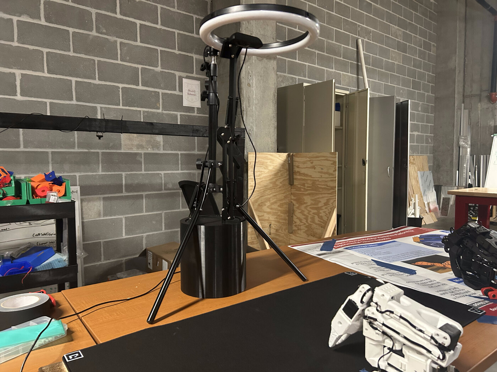
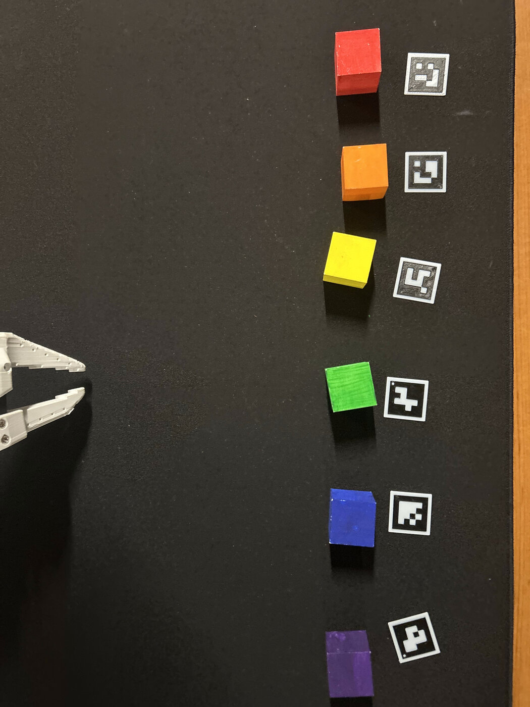
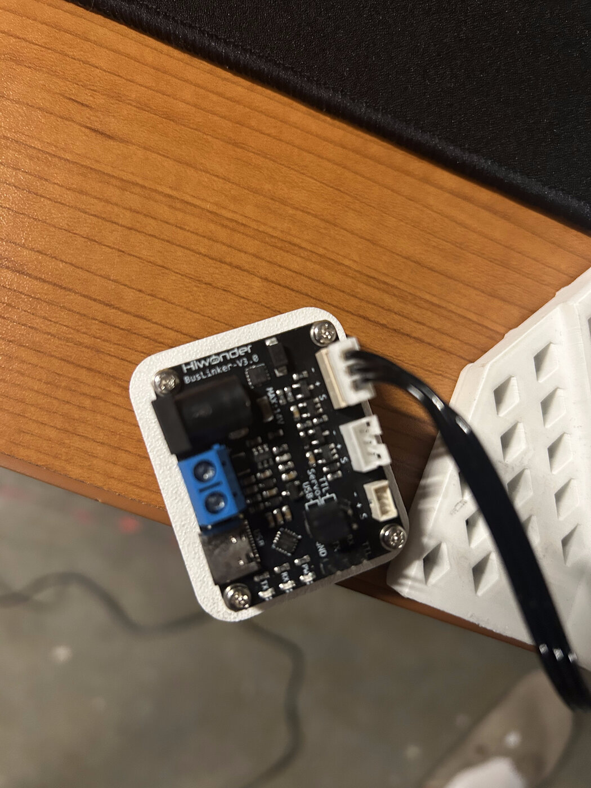
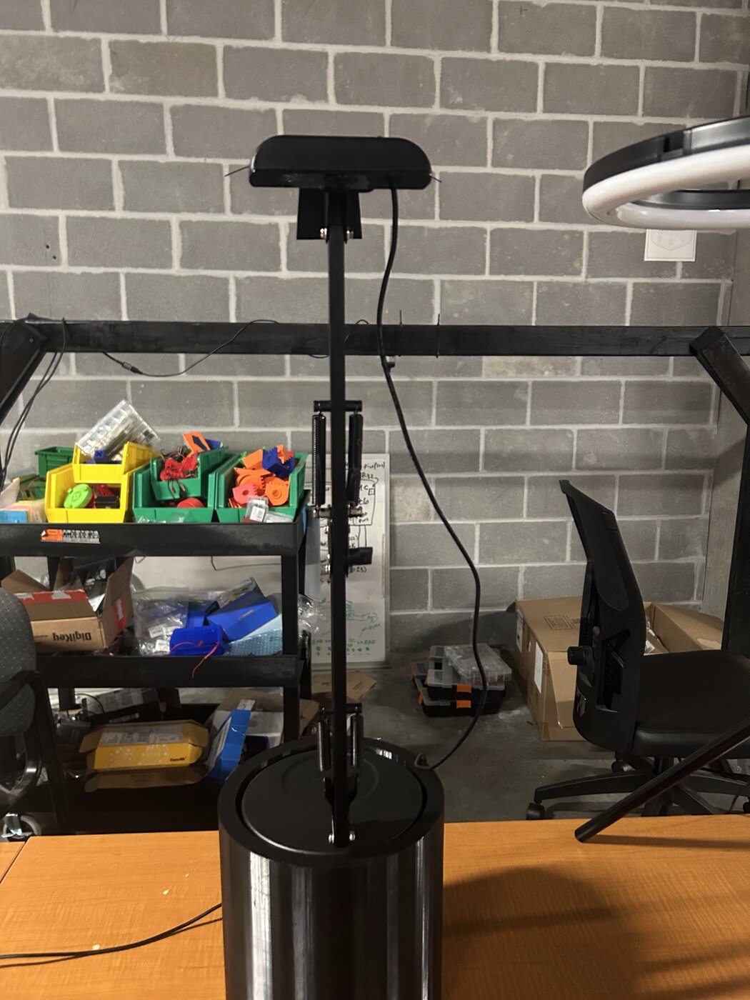
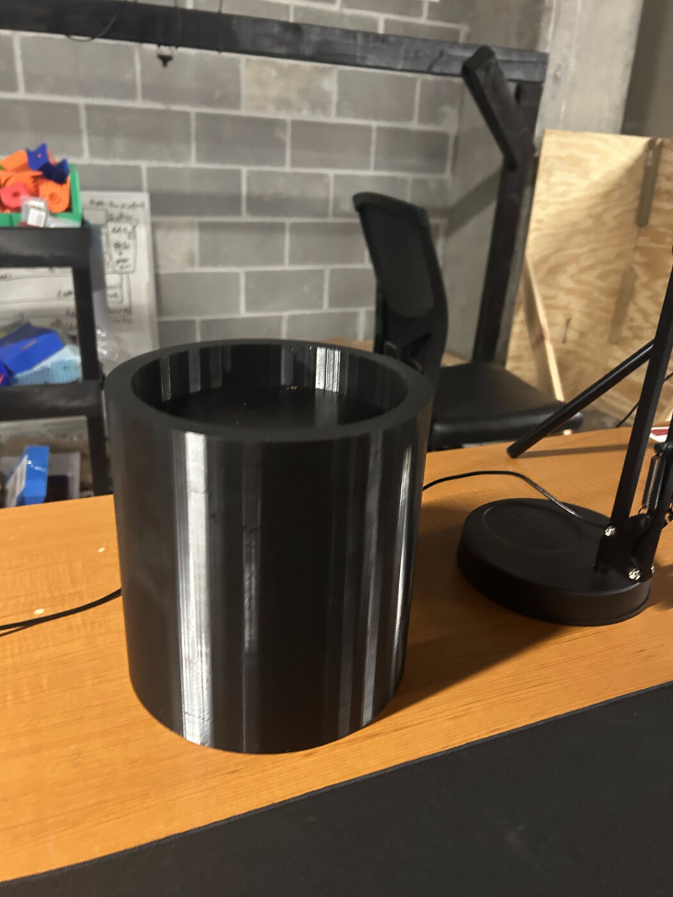
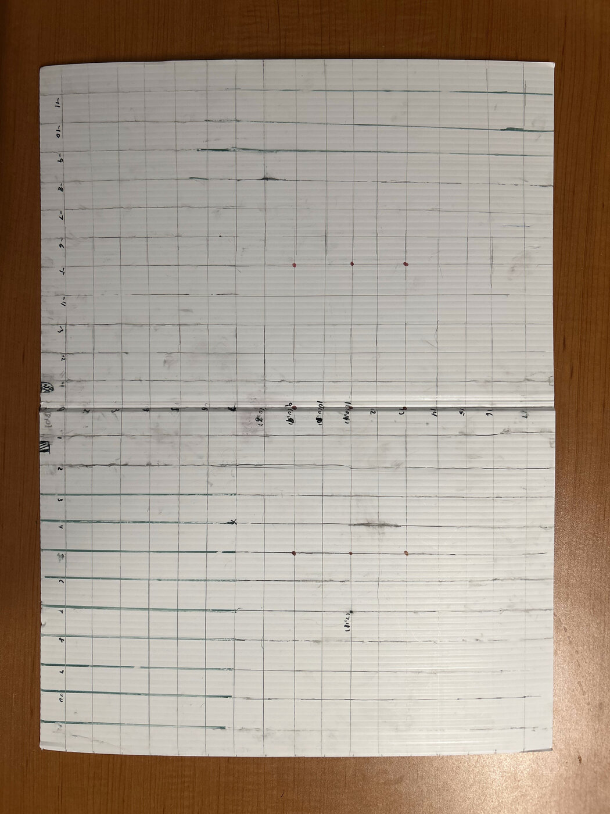
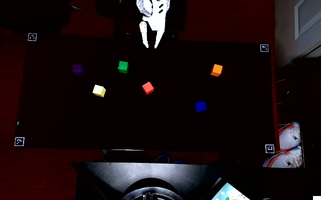
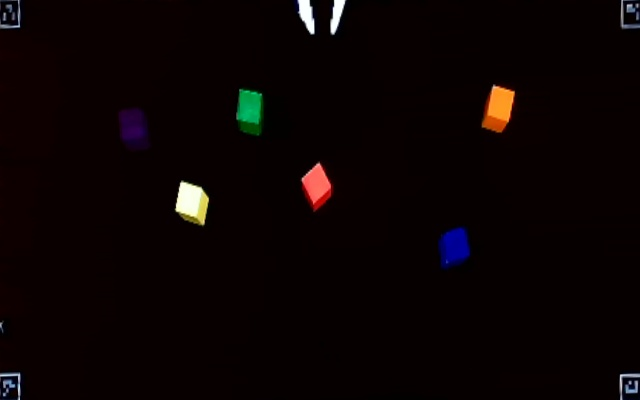
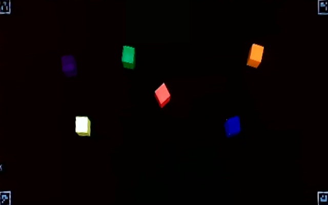
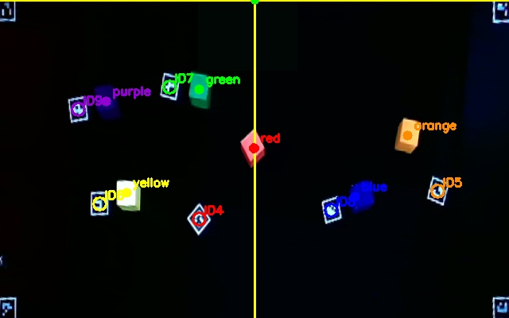

<h1 align="center">AACV — Autonomous Arm with Computer Vision</h1>

<p align="center">
An autonomous 6-DOF robotic arm that uses an overhead camera and OpenCV to find colored cubes on a workspace mat, then picks them up and places them entirely on its own — no teleoperation, no pre-recorded motion paths. The arm detects the cubes, converts their positions into real-world coordinates, and solves its own inverse kinematics to reach and manipulate them.
</p>

<p align="center">
Python • OpenCV • ArUco • Inverse Kinematics • Servo Calibration • Raspberry Pi • Robotics
</p>

## README Contents
- [Overview](#overview)
- [Pipeline](#pipeline)
- [Hardware](#hardware)
- [Inverse Kinematics](#inverse-kinematics)
- [Calibration](#calibration)
- [Vision System](#vision-system)
- [Known Limitations](#known-limitations)
- [Future Improvements](#future-improvements)
- [Credits](#credits)
- [Contact](#contact)

## Overview

The project has two objectives, both built on the same core vision → correction → IK → servo pipeline:

1. **Rainbow Stack** — detect six 3D-printed, painted 30 mm cubes (red, orange, yellow, green, blue, purple) placed anywhere on the mat, and stack them on top of each other in rainbow order. The purple cube's real, detected position becomes the base of the tower — the tower isn't built at a fixed board coordinate, it's built wherever purple actually is.
2. **Color-to-Marker Matching** — cubes are placed anywhere on the mat next to ArUco markers, where each marker ID maps to a color (ID 4 = red, ID 5 = orange, and so on). The arm scans once, matches each visible cube to its marker by color, and sorts every matched pair.

Every cycle, regardless of objective, follows the same shape: look at the workspace, convert what the camera sees into millimeters, correct for the arm's known physical inaccuracy, solve inverse kinematics, convert that into real servo commands, then move.

## Rainbow Stack Demonstration

https://github.com/user-attachments/assets/8b10d193-9655-4c45-8982-1995a2f74699

*Stacks the cubes in ascending rainbow order.*

<p align="center">

</p>
<p align="center"><sub>Detected center-of-mass for all six stacked cubes, overlaid on the warped workspace image.</sub></p>
<!-- Placeholder: swap in a captured frame from the rainbow stack run showing the COM dot for all 6 cubes. -->

### Color-to-Marker Matching Demonstration

**1 block:**

https://github.com/user-attachments/assets/0339e2e1-768a-4214-9200-37bc0f3b5590

*Purple cube matched to marker ID 9 (purple).*

**2 blocks:**

https://github.com/user-attachments/assets/ac4280dd-e74f-4bfe-a10e-287be266cade

*Green and orange cubes matched to their respective markers.*

**3 blocks:**

https://github.com/user-attachments/assets/d50a6ca7-8a57-48fc-9bc0-4a4e0f4cb001

*Green, orange, and purple cubes matched to their respective markers.*

**4 blocks:**

https://github.com/user-attachments/assets/bc9203bc-570f-4966-b7b6-78849c776dac

*Orange, yellow, green, and blue cubes matched to their respective markers.*

## Pipeline

1. **Camera capture** (`vision/vision.py`) — grabs a frame from the overhead webcam and crops it to the workspace.
2. **ArUco marker detection** (`vision/vision.py`) — finds the four corner markers (IDs 0–3) plus, depending on the task, the color-target markers (IDs 4–9).
3. **Perspective homography** (`vision/vision.py`) — warps the workspace into a flat, top-down 640×400 canonical view using `cv2.getPerspectiveTransform`, so pixel measurements correspond to real, undistorted positions instead of an angled camera view.
4. **Cleanup** (`vision/vision.py`) — ArUco marker regions and the bright claw are painted over with surrounding color so neither is mistaken for a cube.
5. **HSV color segmentation + center of mass** (`vision/vision.py`) — each color gets its own HSV threshold mask; the center of mass of the largest matching blob becomes that cube's detected pixel position.
6. **Pixel → mm conversion** (`vision/vision.py`) — marker ID 3's known physical edge length (24.75 mm) is used as a scale reference to convert every cube/marker pixel position into millimeters relative to the arm's origin.
7. **Physical correction interpolation** (`core/IK_solver.py`, `control/*.py`) — a 3×3 measured error grid is interpolated (`scipy.interpolate.RegularGridInterpolator`) to correct for the arm's position-dependent inaccuracy before any IK math runs.
8. **Inverse kinematics** (`core/IK_solver.py`) — converts the corrected (x, y) target into base/shoulder/elbow/wrist joint angles using the law of cosines.
9. **Servo calibration mapping** (`core/IK_solver.py`) — converts each mathematical joint angle into the actual hardware servo command, using per-servo calibration data.
10. **Pick / place sequence + safe retreat** (`control/final_rainbow_stack.py`, `control/color_marker_match.py`) — the high-level task logic: open gripper → move → close gripper → retreat while holding the cube, then move → open gripper → nudge away → fold back to rest.

Requirements are OpenCV (with the `opencv-contrib` ArUco module), NumPy, SciPy, and `pyserial`. Install these with `pip install -r requirements.txt`, then run `python control/final_rainbow_stack.py` or `python control/color_marker_match.py` to orchestrate either pipeline. Both scripts talk to the servo bus over `/dev/ttyACM0` and default to webcam index `0`. Add `--dry-run` to run the full vision + correction + IK pipeline and print what it *would* do without moving any servos, or `--auto` to run the pick/place sequence without waiting for a manual ENTER between steps.

## Hardware

| Component | Purpose |
|---|---|
| SO-101 follower arm (6 DOF) | Base, shoulder, elbow, wrist pitch, wrist roll, gripper |
| Hiwonder/Lewansoul-style serial bus servos | Actuate all 6 joints, driven via `lewansoul-servo-bus` |
| Webcam — NexiGo N60 | Overhead camera, ~737 mm above the mat, captures a cropped 640×400 px workspace |
| Ring light — Bower 12" LED Selfie Ring Light Studio | Consistent, even illumination across the mat for reliable color detection |
| Mat — HyperX XL gaming mat | Flat, uniform dark surface the workspace, cubes, and ArUco markers sit on |
| 3D-printed, painted cubes (30 mm) | Six colors: red, orange, yellow, green, blue, purple |
| ArUco markers (`DICT_4X4_50`) | IDs 0–3: board corners + scale reference. IDs 4–9: color-to-marker task targets |
| Raspberry Pi | Target deployment device (developed on a Mac, runs standalone on the Pi) |

<p align="center">

</p>

| Cubes & ArUco Markers | Servo Bus Controller | Camera on Mount | 3D-Printed Mount Alone |
| :---: | :---: | :---: | :---: |
|  |  |  |  |

The camera (NexiGo N60) sits on an adjustable stand with the Bower ring light for consistent illumination, elevated on a 3D-printed mount to get the height needed for a full overhead view of the mat. The workspace itself is a HyperX XL gaming mat, chosen for its flat, uniform dark surface. Servos are driven off a Hiwonder BusLinker board rather than talking to each servo individually.

The arm itself wasn't designed by us — it's the open-source **SO-101 follower arm**, sourced and 3D-printed from its published STL files and reference control code rather than bought pre-built. We first verified it fully under its stock leader/follower teleoperation scripts, then wrote all of the autonomous vision + control logic in this repo completely from scratch, independent of that source code.

ArUco markers went through a few material iterations. Paper-printed markers glared badly under normal room lighting and caused missed detections; switching to 3D-printed markers with matte filament fixed it — see [Known Limitations](#known-limitations) for more on this.

## Inverse Kinematics

The arm is treated as a 3-link planar arm for IK purposes — base, shoulder, and elbow are solved directly; the wrist is derived, not solved independently.

**Link lengths:**
```
L1 = 115.48 mm   (upper arm)
L2 = 135.81 mm   (forearm)
L3 = 185.71 mm   (end-effector reach)
Z_offset = 127 mm
```

**Given a target (x, y):**
```
R    = sqrt(x² + y²)                # horizontal distance from base to target
R_w  = R - L3                       # distance to the wrist, after removing end-effector length
Z_w  = Z_target - Z_offset          # wrist height relative to the shoulder
D    = sqrt(R_w² + Z_w²)            # shoulder-to-wrist distance

base_angle     = atan2(y, x)
elbow_angle    = acos((L1² + L2² - D²) / (2 * L1 * L2))
shoulder_angle = acos((D² + L1² - L2²) / (2 * D * L1)) + atan2(Z_w, R_w)
wrist_angle    = 180 - (shoulder_angle + elbow_angle)
```

Both `shoulder_angle` and `elbow_angle` come straight out of the law of cosines applied to the shoulder–elbow–wrist triangle. Forcing `wrist_angle` to always sum with the other two to 180° keeps the gripper parallel to the ground at every target, so the claw always approaches a cube from the side rather than from directly above — this maximizes reach, at the cost of being a slightly awkward approach angle for cubes very close to the base. A "dead zone" close to the base is excluded entirely, since targets that close aren't reachable correctly with this geometry.

## Calibration

Getting the IK math right wasn't enough on its own — two separate layers of physical calibration sit on top of it.

**1. Servo calibration** (`calibration/calibration_results.json`, `calibration/motor_calibration.py`)
The joint angle IK produces doesn't map 1:1 onto the servo's own electrical angle — mounting offsets and mechanical load mean the two scales don't line up. Each servo stores a `reference_joint_angle` / `reference_servo_angle` pair (a known joint angle and the actual hardware angle that produces it), a scale factor, and an `inverted` flag. `map_angle_to_servo()` uses these to convert a desired joint angle into the real command to send, then clamps it to that servo's safe physical range:

```
hardware_angle = reference_servo + sign * (joint_angle - reference_joint) * scale
```

**2. Physical position-error correction** (`calibration/arm_corrections.json`, `calibration/manual_arm_cal.py`)
Even with servo calibration correct, the arm was consistently off by a few inches when reaching a specific (x, y) target — and critically, the error wasn't uniform across the workspace. The right side needed a substantially larger correction than the left side, so a single global offset would fix one side while making the other worse. Instead, actual landing error was measured at a 3×3 grid of known points:

```
X = -127.0, 0.0, 127.0 mm
Y = 228.6, 279.4, 330.2 mm
```

At each point, the difference between the commanded and actual position was recorded as a delta: `{"target": [x, y], "delta": [dx, dy]}`. Those 9 samples feed a `scipy.interpolate.RegularGridInterpolator` at runtime, so any arbitrary target between grid points gets a locally-interpolated correction instead of one flat number.

<p align="center">

</p>
<p align="center"><sub>The DIY grid board used to measure actual landing position against commanded targets before the arm was tested on the real mat.</sub></p>

On top of both of these, a handful of small, deliberately *separate* task-specific biases handle physical quirks the general correction map can't capture:

- **Left-side pickup bias** — the claw only opens toward the right, so a cube on the left side is approached at a sharper angle to guarantee a clean grasp.
- **Placement bias (X/Y)** — placement was systematically shifted from pickup position; tuned separately so fixing one didn't break the other.
- **Safe base nudge** — after placing a cube, the base rotates a few degrees away *before* the rest of the arm folds back, so the claw clears the tower/marker vertically instead of dragging back through it. Only active after placement, not pickup — it wasn't needed there and risked introducing new error.
- **Red extra Z clearance** (rainbow stack only) — the topmost cube gets a little extra placement height so it doesn't clip the stack underneath it.

## Vision System

The vision system's job is to reliably locate every colored cube on the mat, find the four corner ArUco markers, and (depending on the task) find the additional marker IDs 4–9 — then convert all of that into metric (X_mm, Y_mm) target vectors the arm can act on. It's built entirely on OpenCV and OpenCV's ArUco library, through four core stages:

- Reference marker tracking & boundary extraction
- Planar perspective homography & orthorectification
- Image preprocessing & noise reduction
- Multi-color HSV identification & center-of-mass (COM) localization

### Why ArUco, and why 3D-printed markers specifically

The board-detection approach went through three iterations. The first version used four hardcoded pixel coordinates for the mat's corners — no dynamic adaptation at all, so any change to the camera position, the mat, or basically anything else broke it immediately. The second version moved to ArUco markers detected via `cv2.aruco.ArucoDetector`, which fixed the adaptability problem but introduced a new one: the markers were printed on paper, and paper glares under normal room lighting enough that the camera would intermittently fail to identify them. The third and final iteration replaced those with 3D-printed markers in matte filament, which are far less reflective — this produced stable ID identification and zero marker dropouts across varying lighting conditions.

IDs 0–3 mark the four corners of the mat and are used to compute the homography matrix; ID 3 is also reused as the physical scale reference (more below). IDs 4–9 are the color-to-marker task's placement targets.

### Camera setup

The camera sits 736.6 mm above the mat and captures a 640×400 px cropped workspace image. Camera hardware parameters (exposure, gain, etc.) are locked to fixed baseline values rather than left on auto, so color readings stay consistent between frames instead of drifting as the camera re-exposes.

### Perspective warp

To maximize the usable boundary, each corner marker's outer-most vertex is used as its source point (e.g. marker ID 0 sits in the bottom-left of the mat, so its bottom-left corner vertex is the source point). The four resulting source points define a planar homography matrix `H ∈ R^(3×3)`, computed via Direct Linear Transform through `cv2.getPerspectiveTransform()`, which warps the workspace into a canonical 640×400 rectangular image:

```
P_dst = H · P_raw

[u_warped]       [u_raw]
[v_warped]  ~ H  [v_raw]
[   1    ]       [  1  ]
```

Every downstream measurement — cube positions, marker positions, the mm/pixel scale — happens in this flat, top-down warped space rather than the original angled camera view.

<p align="center">
  
  
</p>
<p align="center"><sub>Raw angled camera capture (left) vs. the homography-warped, top-down 640×400 canonical view (right).</sub></p>
<!-- Placeholder: side-by-side of the raw frame and the cv2.getPerspectiveTransform output. -->

### Noise reduction

High-contrast regions — the black/white ArUco patterns and the white robot claw — were producing false-positive color detections, so a two-stage cleanup pass runs before any HSV thresholding:

1. **Marker removal.** A mask is built from all detected marker polygons in the warped image, each dilated by an extra 10 mm via `cv2.dilate()` to fully cover the tag plus a small margin, then subtracted from the color mask with `cv2.bitwise_not(tag_mask)`.
2. **Claw removal.** The claw is located with a threshold-based bounding box, then that region is filled in with the mean color sampled from its perimeter — removing the claw's bright, high-contrast footprint from the mask without leaving an obvious hole.

<p align="center">
 
  
</p>
<p align="center"><sub>Before (left) and after (right) marker dilation/removal and claw perimeter-fill cleanup.</sub></p>
<!-- Placeholder: before/after frame showing the marker + claw masks painted out. -->

### HSV color segmentation

After cleanup, the warped image is thresholded per color using `cv2.inRange()`, with each color tuned to its own hue/saturation/value range:

| Target Color | Hue Range (H) | Saturation Range (S) | Value Range (V) |
|---|---|---|---|
| Red | [0, 5] ∪ [160, 180] | [40, 255] | [50, 255] |
| Orange | [12, 30] | [60, 255] | [100, 255] |
| Yellow | [80, 100] | [0, 40] | [230, 255] |
| Green | [75, 89] | [80, 255] | [50, 255] |
| Blue | [90, 120] | [50, 255] | [100, 255] |
| Purple | [121, 159] | [70, 255] | [50, 255] |

Red needs two disjoint hue ranges since red wraps around both ends of OpenCV's 0–180 hue scale. Yellow's unusually tight, low-saturation range exists because under this setup's lighting, yellow reads closer to a bright near-white than a saturated color — see [Known Limitations](#known-limitations) for more on warm-color detection being harder than cool-color detection in general.

<p align="center">

</p>
<p align="center"><sub>Binary HSV masks for each of the six target colors after `cv2.inRange()` thresholding.</sub></p>
<!-- Placeholder: grid of the 6 per-color cv2.inRange() masks side by side. -->

### Center-of-mass extraction

Each color mask is smoothed with a 5×5 Gaussian blur to reduce residual noise, then its centroid is computed from the mask's raw spatial image moments via `cv2.moments()`:

```
cX = M["m10"] / M["m00"]
cY = M["m01"] / M["m00"]
```

That (cX, cY) pixel coordinate is the cube's detected pickup point.

<p align="center">

</p>
<p align="center"><sub>Full color-to-marker pipeline: warped frame with each detected cube's center-of-mass matched to its corresponding ArUco marker ID.</sub></p>
<!-- Placeholder: annotated frame from color_marker_match.py showing cube COM -> marker ID pairings. -->

### Physical scale calibration

Marker ID 3 doubles as a known-size physical reference: its real edge length is 24.75 mm, and a pixel-to-millimeter ratio (`S_pixel`) is derived by averaging all four of its warped boundary edge lengths against that known measurement. Every pixel distance measured anywhere on the board — cube positions, marker positions — is multiplied by this single ratio to get millimeters.

### Coordinate origin mapping

The coordinate origin is placed at the top-center of the warped image, since that lines up with the arm's own physical origin. Given a raw pixel coordinate `(x_raw, y_raw)` in the 640-wide warped image:

```
X_mm = (320 - x_raw) * S_pixel
Y_mm = (y_raw * S_pixel) - 45mm
```

The `-45 mm` offset on Y exists because the arm's actual physical pivot point sits outside the camera's frame, not at the visible top edge of the mat — so this constant shifts every Y measurement to line up with where the arm's origin actually is.

<p align="center">

</p>
<!-- This is the debug overlay the vision script produces showing detected cube/marker COMs plotted against the X/Y origin -- swap in a current capture. -->

## Known Limitations

- **Lighting sensitivity.** Color detection uses fixed HSV thresholds tuned for one lighting setup. Cooler colors (green, blue, purple) separated reliably; warmer colors (red, orange, yellow) were harder, since glare could wash them out or make them bleed into each other. A more robust fix would be adaptive thresholding rather than hardcoded bounds tuned to one room.
- **Left/right accuracy asymmetry.** Positioning error wasn't uniform across the workspace — the right side needed substantially larger corrections than the left. The 3×3 interpolated correction map handles most of this, but the pickup/placement biases layered on top are hand-tuned constants, not analytically derived, and need re-tuning if the arm, camera, or mat moves.
- **Single-frame vision, no averaging.** Each scan uses one camera frame — no multi-frame averaging or tracking to reduce noise in a detected cube position.
- **No automatic verification.** The arm doesn't re-check the camera after a placement to confirm it actually landed correctly — a bad pick or place isn't caught automatically.
- **ArUco marker material mattered more than expected.** Paper-printed markers glared under normal room lighting and caused missed detections; 3D-printed matte markers fixed it, but it was a real failure mode worth knowing about if you're replicating this setup.

## Future Improvements

- Multi-frame averaging/tracking for cube position to reduce vision noise.
- Re-calibrate the 3×3 correction grid after any physical change (new camera position, new mat, moving to different hardware) — current values are specific to the exact setup they were measured on.
- Replace the fixed placement biases with additional measured calibration points instead of hand-tuned constants.
- Tune HSV thresholds under the final, permanent lighting setup rather than whatever was available during development.
- Add a post-placement verification pass using the camera.
- Add collision/reachability checks before committing to a pick or place command.

## Credits

- Arm design and base hardware: the open-source **SO-101 follower arm**, built from its published STL files and reference code — not designed by us, but sourced, 3D-printed, and assembled ourselves. All autonomous vision and control logic in this repo was written from scratch, independent of the arm's stock scripts.
- Servo communication: [`lewansoul-servo-bus`](lib/lewansoul-servo-bus-master) (vendored third-party library — see its own README/LICENSE for details).

## Contact

- **Paul Pham** — [phampp07@gmail.com](mailto:phampp07@gmail.com) • [linkedin.com/in/paul-pham07](https://www.linkedin.com/in/paul-pham07)
- **Cole Burton** — [cole12burton@gmail.com](mailto:cole12burton@gmail.com) • [linkedin.com/in/cole-burton-124464371](https://www.linkedin.com/in/cole-burton-124464371/)

---

<p align="center">If you found this project interesting, feel free to star the repo!</p>
